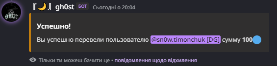

# gh0st
## **Info for gh0st**
Hello!
This is multi bot gh0st!

1. Prefix - **/**
2. Programming language - **Python**

**This is a multi bot that is fully customizable, the bot is set up by commands. Soon a site will be created through which you can view its commands, configure, see all the information about the bot, and you can send ideas for bot commands!**

---

# **Commands**
## **General commands**
### **/menu**
`/menu` - this command is used to see the list of bot commands. Use the select menu to select the category of commands

## **Economy commands**

### **/balance**

`/balance <member>` - shows the user balance

### **/pay**

`/pay <member> <amount>` - transfers money to the user.

**Error codes**

* Error 40051
* Error 40052
* Error 40053

### **/work**

`/work` - you work and get paid. It will be possible to add a robot and change their salary. Addition: if the bot restarts, it will be possible to work again, the delay time is 24 hours. Work and salary is different every time.

**Error codes**

* Error 40054

### **/shop**

`/shop` - Sale of roles, also the administration will be able to add or remove roles from the store.

### **/buy**

`/buy <role>` - Buy a role from the store.

**Error codes**

* Error 40056

### **/reward**

`/reward` - receive a reward (possible every 24 hours). Addition: the reward can be changed with the command **/economy_set_reward**.

**Error codes**

* Error 40054

### **/amount**

`/amount <member> <amount>` - issuing money to the user (for administration only)

**Error codes**

* Error 40037
* Error 40057
---
## **Updates gh0st**

### *Update gh0st!*

**version 0.0.1(beta)**

 **Update economy, add commands**
  * reward (daily)
  * economy_set_emoji (moderate and administrator command)
  * economy_set_reward (moderate and administrator command)
  * work (daily)
    
    
 **Update moderate commands**
  * warn and remove warn
  * stat (beta version)

**Update menu**
  * add all commands for menu

**Further commands that will be added in the next update**

   * Adding economy commands (economy settings)
   * Adding game teams (games, fan teams)
   * Adding commands for setting up auto-moderation
   * Adding commands to configure moderation commands
   * Starting work on the guild system
   * Starting work on private teams

---

Good luck!
